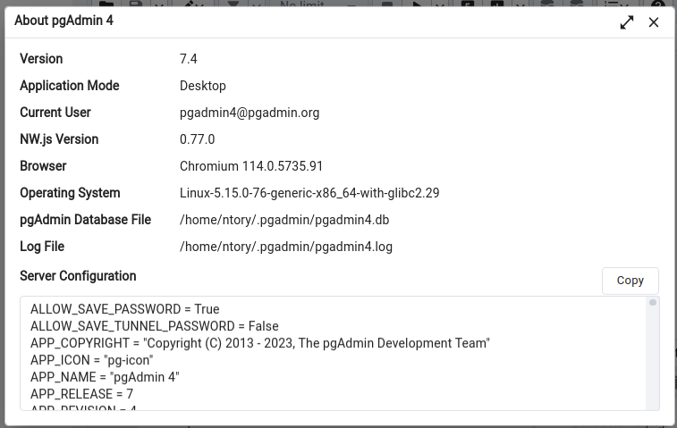
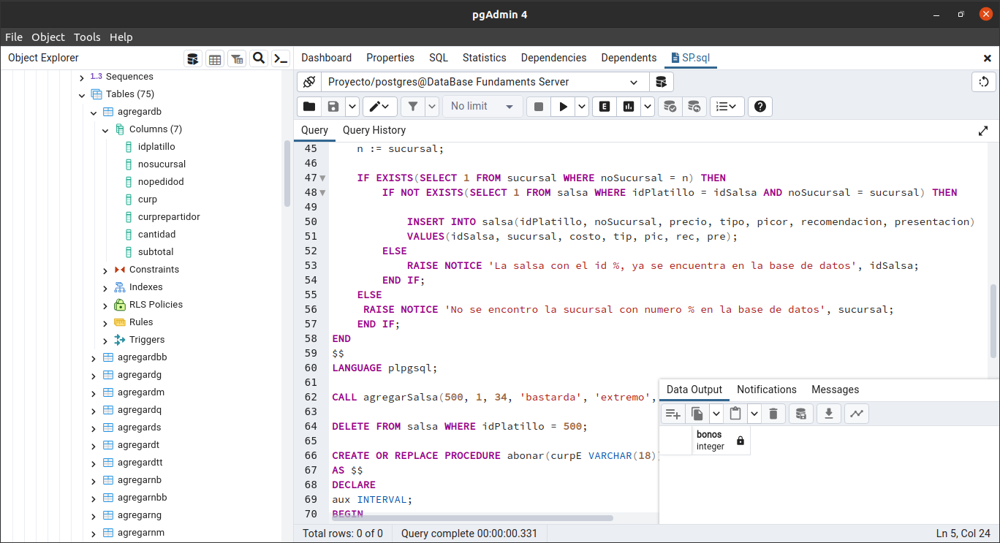

# :taco: :floppy_disk: Database "Taco Riendo" :floppy_disk: :taco: 

**Taco Riendo" taquerias database, school project of the subject Fundamentals of Databases.** The database has several functions, several triggers and some useful procedures for the users.


# :books: Docs: :books:

- [Use Case Specifications.](Docs/CasoDeUso.pdf)

- [Word Dictionary and Query Documentation with code](Docs/ProyectoFinal.pdf)

- Diagrama Entidad-Relación([drawio](Diagramas/RelacionalTacoRiendo.drawio)).

|  |
|:---------------------------:|
| Diagrama de nuestra base de datos. |

- Diagrama Relacional([drawio](Diagramas/ERTacoRiendo.drawio)).

|  |
|:---------------------------:|
| Diagrama Relacional de nuestra base de datos |

- [DDL.](SQL/DDL.sql)
- [DML.](SQL/DML.sql)
- [Functions.sql](SQL/Functions.sql)
- [Queries.sql](SQL/Queries.sql)
- [SP.sql](SQL/SP.sql)

## Versions :star2:

* psql
```
psql --version tenemos:
psql (PostgreSQL) 15.3 (Ubuntu 15.3-1.pgdg20.04+1)
```

* To access the PostgreSQL command line interface as the user "postgres".

```
sudo -u postgres psql
```

*  To view the databases created in PostgreSQL,
```
SELECT datname FROM pg_database;
```

* To enter DB Proyecto:

postgres=# \c Proyecto
psql (15.3 (Ubuntu 15.3-1.pgdg20.04+1), server 14.8 (Ubuntu 14.8-1.pgdg20.04+1))

* pgAdmin4 version:

|  |
|:---------------------------:|
| pgAdmin4 version. |

## :hammer: About Data Base:

### DDL Statements

First execute DDL.sql: set of Data Definition Language (DDL) statements to create the tables of "Taco Riendo" PostgreSQL database.

|  |
|:---------------------------:|
| DDL Execution. |
------

### Triggers. 

These triggers are code snippets that are automatically executed when certain events occur in our database. Triggers can be triggered by actions such as inserting, updating, or deleting records in specific tables.

Here's an overview of each of the mentioned triggers:

- `clienteDefault()`: This trigger is fired after inserting a record into the `sucursal` table and is responsible for inserting a default record into the `persona` table with some default values.

- `subtotalNB()`, `subtotalNBB()`, `subtotalNG()`, `subtotalNM()`, `subtotalNQ()`, `subtotalNS()`, `subtotalNT()`, `subtotalNTT()`: These triggers are executed after inserting records into the `agregarNB`, `agregarNBB`, `agregarNG`, `agregarNM`, `agregarNQ`, `agregarNS`, `agregarNT`, and `agregarNTT` tables, respectively. These triggers update the `subtotal` field based on the multiplication of the `cantidad` and `precio` fields in the related tables.

- `subtotalDB()`, `subtotalDBB()`, `subtotalDG()`, `subtotalDM()`, `subtotalDQ()`, `subtotalDS()`, `subtotalDT()`, `subtotalDTT()`: These triggers are similar to the previous ones but are executed after inserting records into the `agregarDB`, `agregarDBB`, `agregarDG`, `agregarDM`, `agregarDQ`, `agregarDS`, `agregarDT`, and `agregarDTT` tables.

- `subtotalUpdate()`, `subtotalUpdateDom()`: These triggers are executed after updating records in the `agregarNB`, `agregarNBB`, `agregarNG`, `agregarNM`, `agregarNQ`, `agregarNS`, `agregarNT`, and `agregarNTT` tables, respectively. These triggers update the `subtotalesPEDN` table with the new values of `noPedidoN` and `subtotal` in case of updates.

- `totalPedido()`: This trigger is executed before inserting a record into the `pagarConE`, `pagarConT`, or `pagarConP` tables and is responsible for updating the `totalP` field in the `pedidoD` or `pedidoN` tables depending on whether the order is for delivery or not.

- `totalTicket()`: This trigger is executed after inserting a record into the `pagarConE`, `pagarConT`, or `pagarConP` tables and is responsible for updating the `total` field in the `ticket` table based on the type of order (delivery or not).

- `registrosQ()`, `registrosB()`: These triggers are executed after inserting records into the `registroQ` and `registroB` tables, respectively. They update the `precio` field in the `quesadilla` and `burrito` tables based on the new values of `precioNuevo`.

These triggers are used to automate certain tasks and maintain data consistency in the database. Each trigger is associated with a specific table and is executed when certain events related to that table occur.

* Execution of [Triggers](SQL/Triggers.sql)

|  |
|:---------------------------:|
| Triggers Execution. |
------

### Funtions content

The file contains a series of functions stored in PostgreSQL that perform various operations on the "Taco Riendo" database. Here is a summary of the functions included:

- `antiguedad(char(18))`: Calculates the seniority of employees in the branch based on their CURP (Unique Population Registry Code).

- `masantiguo()`: Gets the oldest employee from all branches.

- `antiguo(int)`: Gets the CURP of the oldest employee from a specific branch.

- `ganancias(INT)`: Calculates the earnings of a specific branch.

- `promofav(int)`: Calculates the most applied promotion in a specific branch.

- `bestpromo()`: Gets the most applied promotion from all branches.

- `picorfav(int)`: Calculates the spiciness level of the best-selling salsa in a specific branch.

- `presfav(int)`: Calculates the most requested salsa presentation in a specific branch.

- `mining()`: Gets the ingredient with the shortest expiration period for each branch.

- `maxing()`: Gets the ingredient with the longest expiration period for each branch.

- `bestprove()`: Gets the suppliers with affordable prices by product type.

- `best(VARCHAR(20))`: Given the product type, gets the supplier with affordable products.

These functions can be used in a PostgreSQL database to perform queries and operations related to employees, earnings, promotions, salsas, ingredients, and suppliers of the food branch.

* Execution of [Functions](SQL/Functions.sql)

|  |
|:---------------------------:|
| Functions Execution. |

### Populating our database

* Execution of [DML.sql](SQL/DML.sql)(6560 ln) to perform a test populating of our database.

|  |
|:---------------------------:|
| DML Execution. |
------

### Some Procedures of "Taco Riendo" Database. :blue_book:
 
* Execution of [SP.sql](SQL/SP.sql): file containing some procedures.

|  |
|:---------------------------:|
| SP Execution. |

- Procedure `agregarRepartidor`: This procedure receives parameters representing the information of a delivery person. It verifies that the fields nombreR (name), paternoR (last name), and maternoR (middle name) only contain letters and spaces. If this condition is met, it inserts a record into the persona (person) table with the provided data, and also inserts a record into the repartidor (delivery person) table with specific delivery person data. If the information does not pass the validation, an "Invalid information" notification is displayed.

- Procedure `agregarSalsa`: This procedure receives parameters related to sauce information. It verifies the existence of a branch with the specified number. If the branch exists, it checks if a sauce with the same idPlatillo and noSucursal already exists. If it doesn't exist, it inserts a new record into the salsa (sauce) table with the provided data. Otherwise, a notification is displayed indicating that the sauce already exists in the database.

- Procedure `abonar`: This procedure receives a parameter curpE (employee's CURP) and performs operations related to an employee's bonus. It first retrieves the employee's tenure based on their CURP. If the number of years of tenure is even, it performs a series of checks to update the bonuses in the corresponding payroll tables for the employee. If the employee is not found in any of the tables, it updates the nominaM table with the new bonuses.

- Procedure `dosAnios`: This procedure takes no parameters and iterates over the CURPs of employees in different tables (parrillero, mesero, cajero, taquero, tortillero, repartidor) using a FOR loop. For each CURP, it calls the bono procedure, but the body of the bono procedure is not found in the provided code. The line -- RETURN NEXT; is commented, suggesting that the procedure should return a table.

**It's important to note that the provided code is specific to PostgreSQL and uses the plpgsql extension to define stored procedures.**
------

###  Queries Documentation. :bookmark:

* Execution of [Queries.sql](SQL/SP.sql): file containing some queries from the "Taco Riendo" database that test the performance of our database.

|  |
|:---------------------------:|
| Queries Execution. |

* Query 1: **Description:** Retrieves the promotion that is most applied in each branch.
* Query 2: **Description:** Retrieves a summary of the CURP, full name, and employee type of the oldest employee in each branch.
* Query 3: **Description:** Retrieves the ingredient with the shortest expiration period for each branch.
* Query 4: **Description:**  Retrieves the ingredient with the longest expiration period for each branch.
* Query 5: **Description:** Retrieves information about the provider that offers the most products for each type.
* Query 6: **Description:** Retrieves information about the person with the longest working time in the Schaden LLC branch, including their age and employment tenure.
* Query 7: **Description:** Retrieves the preferred spiciness and presentation of sauce for the branch with the most home delivery orders.
* Query 8: **Description:** Retrieves the total sum of all tickets from the Christiansen Inc branch in California.
* Query 9: **Description:** Retrieves the tickets issued by the Christiansen Inc branch located in California.
* Query 10: **Description:**  Retrieves a summary for each branch including the highest sale, the lowest sale, the average sale, the total sales, and the number of tickets.
* Query 11: **Description:**  Retrieves the profits of all branches located in New York.
* Query 12: **Description:** Retrieves information about the tickets of the tables served throughout this year in the state of Minnesota.
* Query 13: **Description:** Retrieves the total served by each waiter in all branches, within the last year, for table type.
* Query 14: **Description:**  Retrieves branches with 2 or more delivery drivers who have a motorcycle as their means of transportation.
* Query 15: **Description:** Retrieves a summary with the full name, CURP, email, and points of the customer with the highest accumulated points.


# :bomb: Team :gun:

- Alejandra Ortega García
    - Usuario de Git: `@ale04`

- Eduardo Leonel Sánchez Velasco
    - Usuario de Git:

- Mónica Miranda Mijangos
    - Usuario de Git:

- :scroll: José Manuel Pedro Méndez :pushpin:
    - Número de git: `Jose-MPM`
    - Usuario de GitLab: `@jose.mpm`
    - Docker ID: `ntory`

------
⌨️ Documented with much :purple_heart: by [Jose-MPM](https://github.com/Jose-MPM) 😊⌨️